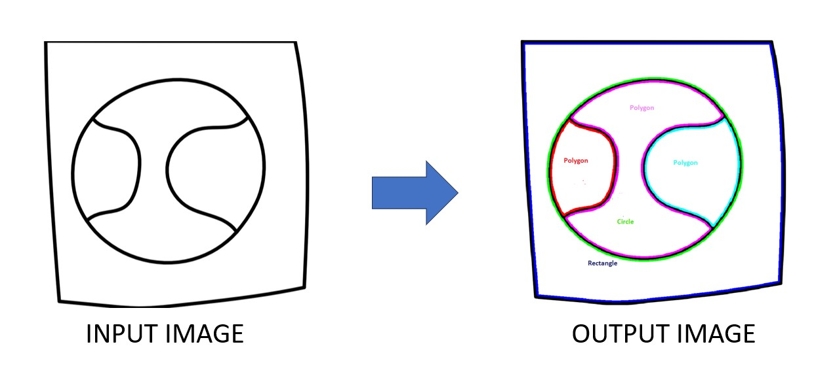
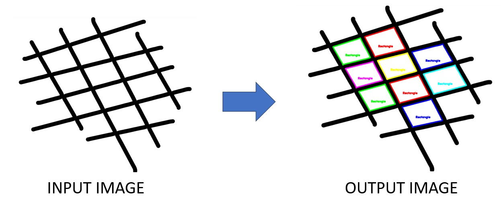
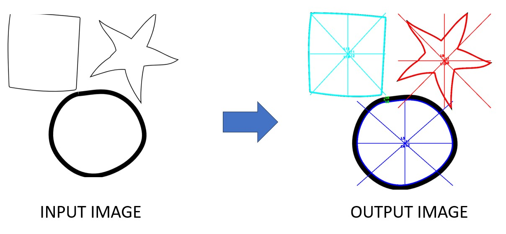
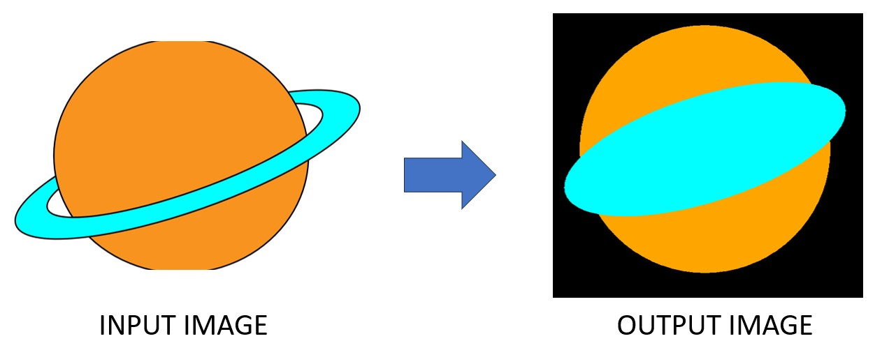

# GenSolve | Curvetopia

GenSolve is a Python-based tool developed for the Adobe x GeeksforGeeks Hackathon, designed to process and analyze various geometric shapes by converting them into cubic Bezier curves. The project leverages several libraries, including NumPy, Matplotlib, Shapely, and SciPy, to facilitate the identification and manipulation of shapes like lines, circles, ellipses, rectangles, and more.

We have used two methods to solve the problems , first we have using Machine Learning and the second methods uses pure mathematics to achieve the same goal.

## File Structure
+ assets/                      (Folder containing images for readme)
+ shapes/                      (Folder containing shape datasets)
  + circle/
  + ellipse/
  + rectangle/
  + rounded rectangle/
  + star/
  + triangle/
  + square/
+ data_augmentation.py         (Script for augmenting dataset images)
+ data_creation.py             (Script for downloading and creating additional shape images)
+ display_model.py             (Script for predicting shapes in images using a trained model)
+ make_model.py                (Script for training a CNN model for shape detection)
+ occlusion.py                 (Script for completing shapes in an input image)
+ symmetry.py                  (Script for finding lines of symmetry in shapes)
+ Regularization&Symmetry.ipynb (Script for method 2)
  
# Method 1 - OpenCV 


## Problem 1: Shape Detection

### Steps:
1. **Download Shape Dataset**:
   - Download a dataset containing images of four shapes (circle, square, star, triangle) from [Kaggle](https://www.kaggle.com/datasets/smeschke/four-shapes?resource=download).
   - Store the dataset in the `shapes` folder.

2. **Create Additional Shapes**:
   - Run `data_creation.py` to download additional images for ellipse, rectangle, and rounded rectangle.
   - Manually remove any noisy images from this new set.

3. **Augment Dataset**:
   - Use `data_augmentation.py` to increase the number of images in the ellipse, rectangle, and rounded rectangle categories, completing the final dataset.
   - Include some sample images from each category.

4. **Train the Model**:
   - Run `make_model.py` to train a Convolutional Neural Network (CNN) for shape detection using the prepared dataset.

5. **Predict Shapes**:
   - Run `display_model.py` to predict the shapes in input images, providing a solution to Problem 1.



## Problem 2: Symmetry Detection

### Steps:
1. **Find Lines of Symmetry**:
   - Run `symmetry.py` to identify lines of symmetry in each shape present in an input image.
   - View the lines of symmetry with labels on the diagram, and check the terminal output for the names of the lines that are actual symmetries.

As shown in this example the terminal outputed `L1,L2,L3,L4`, `L8`,`L11,L12,L13,L14` as the lines of symmetry.

## Problem 3: Shape Completion (Occlusion)

### Steps:
1. **Complete Occluded Shapes**:
   - Run `occlusion.py` to complete the shapes in the input image where parts of the shapes may be missing or occluded.
 


# Method 2 -Mathematical Approach

## Installation

To get started with GenSolve, clone the repository and install the required dependencies using pip:

```bash
git clone git@github.com:Bhardwaj-Prabal/Gensolve-Curvetopia-Solution.git
cd gensolve
pip install -r requirements.txt
```

## How to run
```bash 
pip Regularization&Symmetry.ipynb
```

## How It Works
- **Input:** Users provide a CSV file containing coordinate data of various shapes.
- **Classification:** The tool classifies the data into different shape categories.
- **Regularization:** Each shape is then processed to become a perfect geometric form using specialized functions.
- **Symmetry Analysis:** The tool counts and analyzes symmetries within the shapes, providing valuable geometric insights.

## Usage

To use GenSolve, follow these steps:

1. Place your CSV file in the project directory.
2. Run the main script to process the CSV data.
3. View the output, which includes the regularized shapes and symmetry counts.

## Perfecting Geometric Shapes

GenSolve includes several functions to adjust identified shapes to their ideal forms, such as perfect circles, rectangles, and lines.

## Screenshots

Input image<br/>


Output<br/>


Input image<br/>


Output image<br/>

